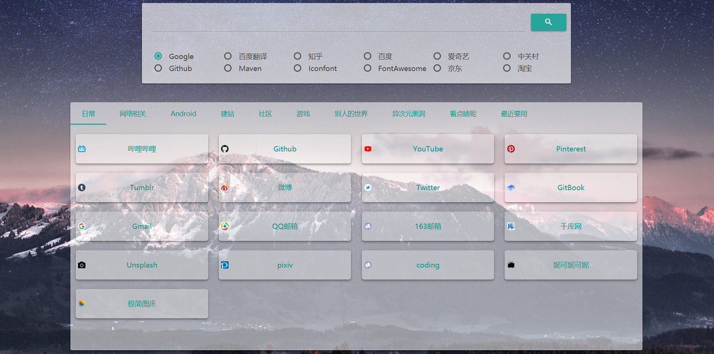
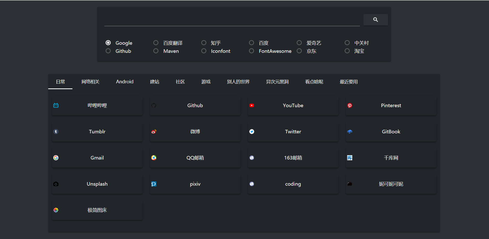

# portal

一个优雅的网站导航

## 白色主题



[点击下载](https://github.com/ChenViVi/portal/releases/download/white-0.0.1/portal.zip) | [预览](http://valorachen.club/portal/index.php)

## 黑色主题（不支持自定义背景，换了背景会很吃藕的好伐）



[点击下载](https://github.com/ChenViVi/portal/releases/download/dark-0.0.1/portal-dark.zip) | [预览](http://valorachen.club/portal/index-dark.php)

## 优点

- 能显示绝大部分网站的icon
- 抛弃各大导航网站所使用的表格布局，而选择用Tab来将网站分类。避免因内容太密集而无法快速找到想要的网站
- 可以自由的定制搜索引擎，不仅可以使用谷歌或百度这种常用搜索引擎，还可以搜知乎，搜B站，搜有土鳖，甚至搜种子。只要你知道站点的搜索链接，啥都能搜
- 使用右键菜单即可完成所有增删改操作，使用鼠标拖拽来重新排序。所有你需要的功能，仅需一个页面即可轻松搞定
- 使用ip白名单来限制访问，无需繁杂的注册登录找回密码操作
- UI美观，且背景默认使用 [漫月API](http://api.ikmoe.com/)，每次打开随机加载一张背景图片。也可自定义背景墙

## 食用方法

整个项目copy到Web服务器目录下，然后创建个数据库并导入`portal.sql`。如果你需要自定义背景图的话，别忘了存放背景图的`bg`目录要加写入权限。最后在`config.php`编辑你自己的设置，就搞定了。例如下面：

```
git clone https://github.com/ChenViVi/portal.git

cd portal

mysql -uroot -p

create database portal;

use portal;

set names utf8;

source portal.sql;

quit

chmod a+w bg

vim config.php
```

## 感谢

[漫月API](http://api.ikmoe.com/)：一款在线获取随机壁纸的小工具，让你每次刷新，得到不一样的图片！并且均为1080P的标准二次元壁纸

[jQuery-contextMenu](https://github.com/swisnl/jQuery-contextMenu)：一个功能强大且兼容性极高的快捷菜单

[Materialize](http://www.materializecss.cn/)：基于Material Design的主流前端响应式框架

## 项目后续

本项目可能会做成多用户版本正式上线，也可能会做成谷歌插件以支持一键将网站导入到本导航中，到时候也会有更多主题与颜色，也可能会有动态壁纸特效，显示天气与节日，能根据搜索引擎历史做自动补全，个人使用数据分析等功能

部分功能可能会收费，所以当然就不会开源了。但是我同时希望普通用户用起来也能有不错的体验，大概就以这个开源的项目为标准了。所以如果觉得哪里出了bug，或操作体验不好，或者UI太丑不喜欢，或者希望有什么新增功能，欢迎砸issue
