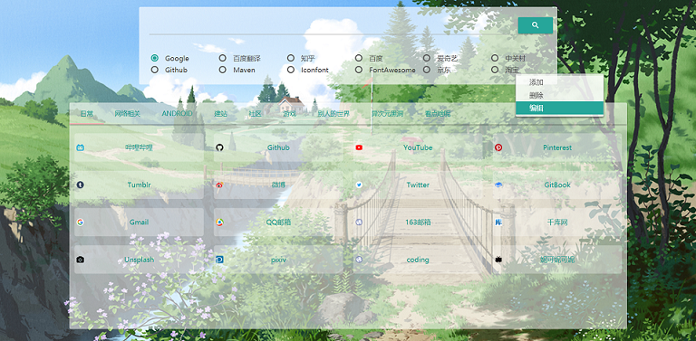

# Portal

一个优雅的网站导航

## 优点

- 能显示绝大部分网站的icon
- 抛弃各大导航网站所使用的表格布局，而选择用Tab来将网站分类。避免因内容太密集而无法快速找到想要的网站
- 可以自由的定制搜索引擎，不仅可以使用谷歌或百度这种常用搜索引擎，还可以搜知乎，搜B站，搜有土鳖，甚至搜种子。只要你知道站点的搜索链接，啥都能搜
- 抛弃复杂的后台，所有增删改操作都在一个页面完成
- 使用ip白名单来限制访问，无需繁杂的注册登录找回密码操作
- UI美观，且背景默认使用 [漫月API](https://ikmoe.com/8548.html)，每次打开随机加载一张背景图片。也可自定义背景墙

## TODO

- [ ] 把以上吹的牛逼实现了先
- [ ] 支持多用户
- [ ] 主题色随背景颜色而变化
- [ ] 搜索引擎支持自动补全，支持搜索历史
- [ ] 显示天气与节日
- [ ] 背景墙支持上传图片URL
